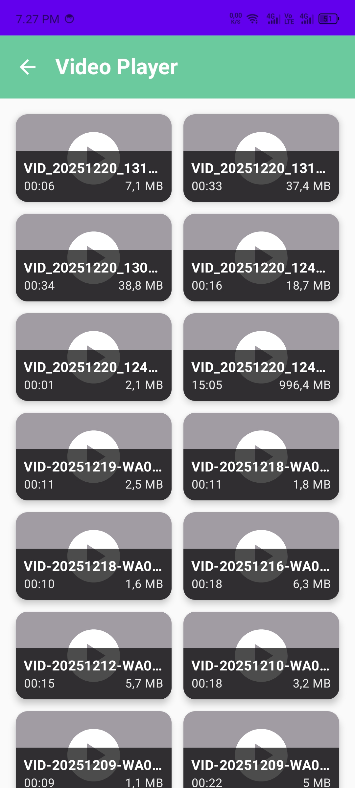
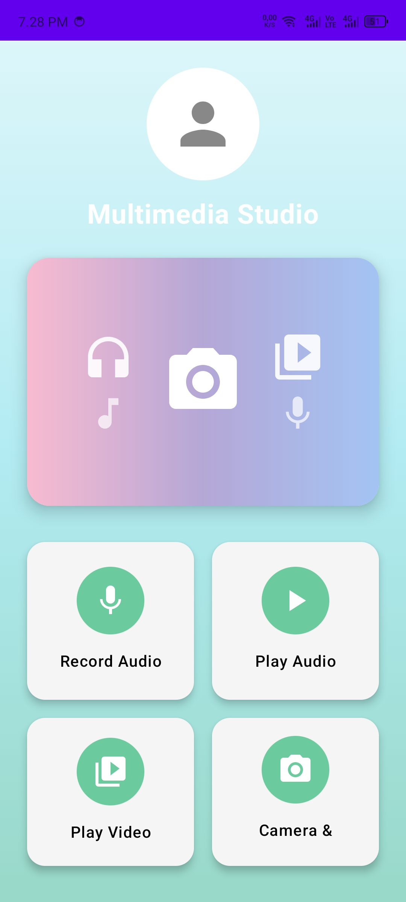
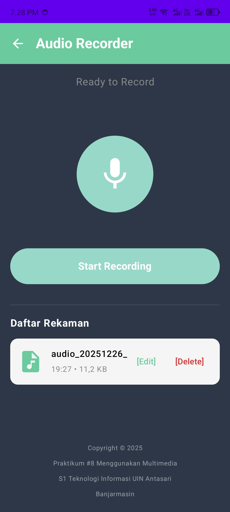
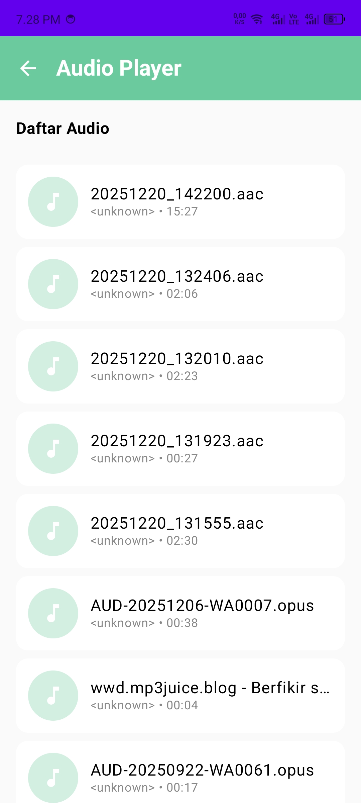
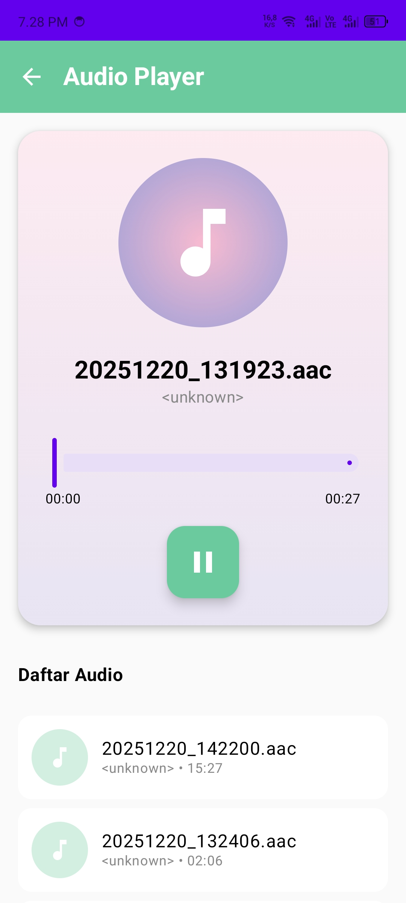
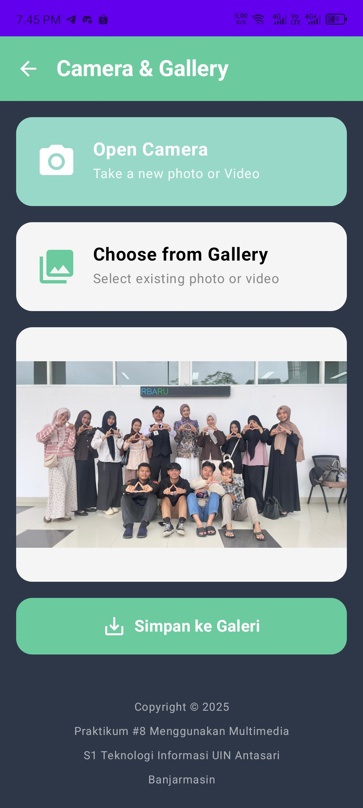

# 📱 Multimedia Studio - Aplikasi Android

> Aplikasi Android modern untuk Camera, Gallery, Audio Recording/Playback, dan Video Player dengan UI soft pastel yang indah

[](https://android.com)
[](https://kotlinlang.org)
[](https://developer.android.com/jetpack/compose)
[](https://m3.material.io)

---

## 📸 Tangkapan Layar

### Layar Utama


**Fitur:**
- Gradient background soft pastel (cyan → mint)
- Hero banner dengan ikon multimedia
- 4 tombol fitur dengan ikon melingkar
- Layout berbasis kartu yang modern

---

### Kamera & Galeri



**Fitur:**
- **Buka Kamera:** Integrasi CameraX dengan switch kamera depan/belakang
- **Pilih dari Galeri:** Tampilan grid untuk memilih foto
- **Preview Gambar:** Pinch zoom (1x-5x) & gestur geser
- **Simpan ke Galeri:** Tombol untuk menyimpan ke penyimpanan publik

---

### Fitur Audio



**Audio Player:**
- Daftar semua file audio dari perangkat
- Kartu Now Playing dengan gradient soft pink-lavender
- Kontrol Play/Pause/Seek
- Pelacakan progres real-time

**Perekam Audio:**
- Rekam audio dengan MediaRecorder
- Kontrol Start/Stop/Pause/Resume
- Ikon mikrofon beranimasi berdenyut
- Daftar, putar, dan hapus rekaman

---

### Video Player


**Fitur:**
- Thumbnail grid (2 kolom) dengan info durasi & ukuran
- Pemutaran fullscreen dengan ExoPlayer
- Kontrol video bawaan
- Dukungan zoom & pan native

---

## ✨ Fitur Utama

### 📷 Kamera & Galeri
- [x] **Tangkap Kamera** dengan CameraX API
- [x] **Ganti Kamera** (depan/belakang)
- [x] **Grid Galeri** (layout 3 kolom)
- [x] **Pinch Zoom** pada preview gambar (1x - 5x)
- [x] **Gestur Geser** untuk navigasi gambar yang diperbesar
- [x] **Tombol Reset Zoom** untuk kembali ke 1x
- [x] **Simpan ke Galeri** - simpan ke Pictures/MultimediaStudio

### 🎵 Pemutar Audio
- [x] **Daftar File Audio** dari penyimpanan perangkat
- [x] **Integrasi ExoPlayer** untuk pemutaran
- [x] **Kartu Now Playing** dengan album art
- [x] **Kontrol Play/Pause/Seek**
- [x] **Update Posisi Real-time**
- [x] **Tampilan Durasi** (saat ini / total)

### 🎙️ Perekam Audio
- [x] **MediaRecorder** untuk perekaman audio
- [x] **Fungsionalitas Start/Stop/Pause/Resume**
- [x] **Timer Real-time** saat merekam
- [x] **Ikon Berdenyut Animasi** feedback visual
- [x] **Format M4A/AAC** untuk kualitas
- [x] **Daftar Rekaman** dengan timestamp
- [x] **Putar & Hapus** rekaman

### 🎬 Pemutar Video
- [x] **Tampilan Grid** untuk thumbnail video
- [x] **Dialog Fullscreen** untuk pemutaran
- [x] **Kontrol ExoPlayer** (play/pause/seek/fullscreen)
- [x] **Preview Thumbnail** dari video
- [x] **Tampilan Durasi & Ukuran File**
- [x] **Dukungan Zoom/Pan** native

### 🎨 UI/UX Modern
- [x] **Warna Soft Pastel** - mint, teal, lavender, pink
- [x] **Desain Material 3** components
- [x] **Jetpack Compose** declarative UI
- [x] **Sudut Membulat** & elevasi kartu
- [x] **Animasi Halus** & transisi
- [x] **Layout Responsif** untuk berbagai ukuran layar
- [x] **Empty States** dengan pesan membantu
- [x] **Penanganan Izin** yang proper

---

## 🛠️ Teknologi yang Digunakan

### Inti
- **Bahasa:** Kotlin
- **Framework UI:** Jetpack Compose
- **Sistem Desain:** Material 3
- **Min SDK:** 24 (Android 7.0)
- **Target SDK:** 35 (Android 15)

### Library & Dependencies

#### Media & Kamera
```kotlin
// CameraX untuk fungsionalitas kamera
androidx.camera:camera-camera2:1.3.1
androidx.camera:camera-lifecycle:1.3.1
androidx.camera:camera-view:1.3.1

// ExoPlayer (Media3) untuk pemutaran audio/video
androidx.media3:media3-exoplayer:1.2.0
androidx.media3:media3-ui:1.2.0
```

#### Navigasi & Compose
```kotlin
// Jetpack Compose Navigation
androidx.navigation:navigation-compose:2.7.6

// Material Icons Extended
androidx.compose.material:material-icons-extended
```

#### Pemuatan Gambar & Izin
```kotlin
// Coil untuk async image loading
io.coil-kt:coil-compose:2.5.0

// Accompanist Permissions
com.google.accompanist:accompanist-permissions:0.32.0
```

#### Lifecycle & Arsitektur
```kotlin
// Komponen Lifecycle
androidx.lifecycle:lifecycle-runtime-ktx:2.7.0
androidx.lifecycle:lifecycle-runtime-compose:2.7.0
```

---

## 📋 Persyaratan

### Persyaratan Sistem
- **Android Studio:** Arctic Fox (2020.3.1) atau lebih baru
- **Gradle:** 8.7+
- **Kotlin:** 1.9.0+
- **JDK:** 11 atau lebih tinggi

### Persyaratan Perangkat
- **Versi Android Minimum:** 7.0 (API 24)
- **Versi Android Target:** 15 (API 35)
- **Hardware:** Kamera, Mikrofon, Akses penyimpanan
- **Internet:** Opsional (untuk pemuatan placeholder gambar)

---

## 🚀 Instalasi & Setup

### 1. Clone Repository
```bash
git clone <repository-url>
cd p8_multimedia_230104040055
```

### 2. Buka di Android Studio
```
File → Open → Pilih folder project
Tunggu Gradle sync selesai
```

### 3. Konfigurasi SDK
Pastikan Android SDK terinstal:
- SDK Platform: Android 15 (API 35)
- Build Tools: 35.0.0
- NDK (opsional)

### 4. Build & Jalankan
```bash
# Via Android Studio
Run → Run 'app' (Shift+F10)

# Via Command Line
./gradlew assembleDebug
./gradlew installDebug
```

### 5. Berikan Izin
Saat pertama kali dibuka, berikan izin:
- ✅ Kamera
- ✅ Mikrofon
- ✅ Penyimpanan (Foto, Video, Audio)

---

## 📱 Panduan Penggunaan

### Kamera & Galeri
1. **Buka App** → Klik "Camera & Gallery"
2. **Ambil Foto:**
   - Klik "Open Camera" (tombol soft mint)
   - Gunakan kontrol kamera (ganti, tangkap)
   - Foto muncul di preview
3. **Zoom & Geser:**
   - **Cubit** dengan 2 jari untuk zoom (1x-5x)
   - **Geser** untuk menggerakkan gambar yang diperbesar
   - Klik tombol **Reset Zoom** untuk kembali ke 1x
4. **Simpan ke Galeri:**
   - Klik tombol "Simpan ke Galeri"
   - Foto tersimpan ke Pictures/MultimediaStudio
5. **Pilih dari Galeri:**
   - Klik "Choose from Gallery"
   - Pilih dari grid foto

### Pemutar Audio
1. Klik "Play Audio" dari beranda
2. Pilih file audio dari daftar
3. Kartu **Now Playing** muncul
4. Gunakan kontrol:
   - **Tombol FAB** untuk play/pause
   - **Slider** untuk seek posisi
   - **Durasi** menampilkan progres

### Perekam Audio
1. Klik "Record Audio"
2. Berikan izin mikrofon
3. Klik **"Start Recording"** (soft mint)
4. **Pause/Resume** sesuai kebutuhan (Android 7.0+)
5. Klik **Stop** (tombol merah)
6. Rekaman muncul di daftar
7. Klik **[Edit]** untuk memutar
8. Klik **[Delete]** untuk menghapus

### Pemutar Video
1. Klik "Play Video"
2. Berikan izin penyimpanan
3. Klik thumbnail video
4. Dialog fullscreen terbuka
5. Gunakan kontrol ExoPlayer:
   - Play/Pause
   - Seek bar
   - Gestur Zoom/Pan
6. Klik **X** untuk menutup

---

## 🎨 Palet Warna

```kotlin
// Warna Soft Pastel
SoftMint = #98D8C8           // Aksen utama
SoftTeal = #6BCB9F           // Tombol & ikon
SoftLavender = #B4A7D6       // Gradien
SoftPink = #F8BBD0           // Gradien
SoftBlue = #A3C4F3           // Gradien
SoftPeach = #FFCCBC          // Aksen opsional
SoftYellow = #FFF9C4         // Aksen opsional

// Background
VeryLightGray = #F8F9FA      // Kartu terang
LightGray = #F5F5F5          // Background kartu
DarkBackground = #2D3748     // Bagian gelap
```

---

## 📂 Struktur Proyek

```
p8_multimedia_230104040055/
├── app/
│   ├── src/
│   │   ├── main/
│   │   │   ├── java/id/antasari/p8_multimedia_230104040055/
│   │   │   │   ├── ui/
│   │   │   │   │   ├── home/
│   │   │   │   │   │   └── HomeScreen.kt       # Beranda dengan hero banner
│   │   │   │   │   ├── gallery/
│   │   │   │   │   │   └── CameraGalleryScreen.kt  # Kamera + Zoom/Pan
│   │   │   │   │   ├── player/
│   │   │   │   │   │   └── AudioPlayerScreen.kt    # Pemutaran audio
│   │   │   │   │   ├── recorder/
│   │   │   │   │   │   └── AudioRecorderScreen.kt  # Perekaman audio
│   │   │   │   │   ├── video/
│   │   │   │   │   │   └── VideoPlayerScreen.kt    # Pemutar video
│   │   │   │   │   ├── theme/
│   │   │   │   │   │   ├── Color.kt
│   │   │   │   │   │   ├── Theme.kt
│   │   │   │   │   │   └── Type.kt
│   │   │   │   │   ├── NavGraph.kt              # Setup navigasi
│   │   │   │   │   └── Screens.kt               # Route screen
│   │   │   │   ├── util/
│   │   │   │   │   ├── FileManagerUtility.kt    # Utilitas file media
│   │   │   │   │   └── VideoFileData.kt
│   │   │   │   └── MainActivity.kt
│   │   │   ├── res/
│   │   │   └── AndroidManifest.xml
│   │   └── build.gradle.kts
│   └── ...
├── doc/                      # Tangkapan layar
├── gradle/
├── build.gradle.kts
├── settings.gradle.kts
└── README.md                 # File ini
```

---

## 🔧 Konfigurasi

### Izin (AndroidManifest.xml)
```xml
<!-- Kamera -->
<uses-permission android:name="android.permission.CAMERA" />

<!-- Penyimpanan -->
<uses-permission android:name="android.permission.READ_MEDIA_IMAGES" />
<uses-permission android:name="android.permission.READ_MEDIA_VIDEO" />
<uses-permission android:name="android.permission.READ_MEDIA_AUDIO" />
<uses-permission android:name="android.permission.READ_EXTERNAL_STORAGE" 
    android:maxSdkVersion="32" />
<uses-permission android:name="android.permission.WRITE_EXTERNAL_STORAGE"
    android:maxSdkVersion="29" />

<!-- Mikrofon -->
<uses-permission android:name="android.permission.RECORD_AUDIO" />
```

### Konfigurasi Gradle
```kotlin
android {
    compileSdk = 35
    
    defaultConfig {
        minSdk = 24
        targetSdk = 35
        versionCode = 1
        versionName = "1.0"
    }
    
    buildFeatures {
        compose = true
    }
    
    composeOptions {
        kotlinCompilerExtensionVersion = "1.5.1"
    }
}
```

---

## 🎯 Checklist Fitur

### ✅ Fitur yang Telah Diimplementasikan
- [x] Tangkap kamera dengan ganti depan/belakang
- [x] Grid galeri pilihan (3 kolom)
- [x] Preview gambar dengan pinch zoom & geser
- [x] Fungsionalitas tombol reset zoom
- [x] Simpan ke galeri publik (folder Pictures)
- [x] Pemutar audio dengan ExoPlayer
- [x] Kartu Now Playing dengan progres
- [x] Perekam audio dengan pause/resume
- [x] Ikon mikrofon berdenyut animasi
- [x] Daftar rekaman dengan putar/hapus
- [x] Pemutar video dengan fullscreen
- [x] Grid thumbnail video (2 kolom)
- [x] Kontrol ExoPlayer untuk video
- [x] Skema warna soft pastel
- [x] Sistem desain Material 3
- [x] Navigasi dengan Jetpack Navigation
- [x] Penanganan izin semua fitur
- [x] Empty states & penanganan error

### 🚀 Fitur Lanjutan
- [x] Transform gestures (pinch zoom + geser)
- [x] MediaStore API untuk penyimpanan publik
- [x] Preservasi state lintas rotasi
- [x] Kalkulasi batas untuk limit geser
- [x] Timer perekaman real-time
- [x] Simpan galeri dengan contentResolver

---

## 🐛 Masalah yang Diketahui & Keterbatasan

### Gradle Build
- ⚠️ Build command line mungkin gagal dengan error "25.0.1"
- ✅ **Solusi:** Gunakan Android Studio untuk build

### Izin
- ⚠️ Beberapa versi Android memerlukan pemberian izin manual
- ✅ **Solusi:** App menyediakan UI permintaan izin

### Zoom Gambar
- ℹ️ Zoom dibatasi hingga 5x untuk performa
- ℹ️ Batas geser dihitung untuk mencegah overscroll

---

## 📝 Catatan Pengembangan

### Kualitas Kode
- ✅ Best practices Kotlin
- ✅ Jetpack Compose declarative UI
- ✅ Pedoman desain Material 3
- ✅ Manajemen state yang proper
- ✅ Komponen lifecycle-aware
- ✅ Penanganan error & edge cases

### Testing
- Manual testing pada perangkat fisik
- Skenario izin telah diuji
- Rotasi & perubahan konfigurasi ditangani
- Empty states diverifikasi

---

## 👨‍💻 Pembuat

**Praktikum #8 - Menggunakan Multimedia**  
Kuliah Mobile Programming S1 Teknologi Informasi  
UIN Antasari Banjarmasin

---

## 📄 Lisensi

Copyright © 2025. Proyek edukasi untuk praktikum mobile programming.

---

## 🙏 Ucapan Terima Kasih

- **Material Design 3** - Sistem desain
- **Jetpack Compose** - Toolkit UI modern
- **ExoPlayer** - Pemutaran media
- **CameraX** - Camera API
- **Coil** - Library pemuatan gambar
- **Accompanist** - Utilitas Compose

---

## 📞 Dukungan

Untuk pertanyaan atau masalah:
1. Cek dokumentasi di `walkthrough.md`
2. Review tangkapan layar di folder `doc/`
3. Periksa pengaturan izin di perangkat

---

**Dibuat dengan ❤️ menggunakan Jetpack Compose & Kotlin**
